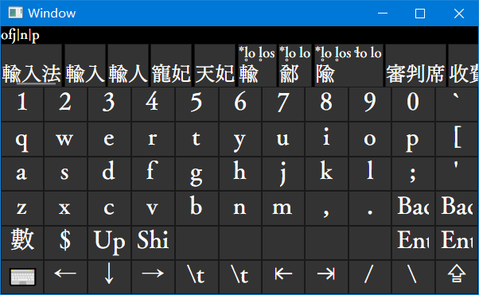

# Avalime

IME Frontend for Rime[https://github.com/rime/librime] with Avalonia



**This project is still in an early stage of progress. That commit a candidate to a focusing input box is not supported by now**

But you can still build and try it manually on Windows:

see `Avalime.Rime/src/RimeSetup.cs`
modify the `dllPath` and `user_data_dir`  according to your actual path.

in Avalime.Windows, run
```bash
dotnet run -r win-x86 # win-x86 is for weasel0.15.0, or use other runtime identifier depending on your rime.dll
```

AOT is also supported, just change `dotnet run` into `dotnet publish -c Release`


